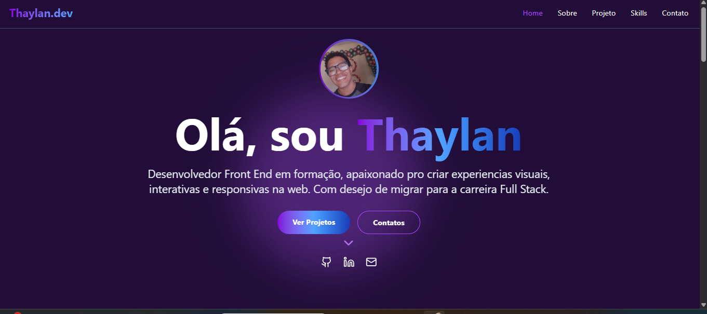

# Portfólio Pessoal | Thaylan Fonseca
**Desenvolvedor Front-end Júnior | React • JavaScript • Tailwind**

Bem-vindo ao meu portfólio pessoal. Este projeto foi desenvolvido para apresentar meus principais projetos, habilidades técnicas e evolução como desenvolvedor front-end. Aqui você encontrará aplicações focadas em responsividade, usabilidade e boas práticas de UI/UX.

**Link do Portfólio:** https://thaylanbf1.github.io/Meu-Portfolio/

---

## 💻 Sobre o Projeto

Este portfólio é uma Single Page Application (SPA) construída com **React** e **Vite**, com foco em performance, organização de componentes e experiência do usuário.  
O objetivo é centralizar minhas informações profissionais e projetos de forma clara e acessível para recrutadores e empresas.

O design foi desenvolvido com **Tailwind CSS**, seguindo abordagem **mobile first** e layout totalmente responsivo.

---

## 🚀 Tecnologias Utilizadas

- React.js  
- Vite  
- JavaScript (ES6+)  
- Tailwind CSS  
- HTML5  
- CSS3  
- Lucide React  

---

## ✨ Funcionalidades

- Seção "Sobre Mim" com resumo profissional  
- Listagem de projetos com descrição e links  
- Apresentação de habilidades técnicas  
- Layout responsivo (desktop, tablet e mobile)  
- Links diretos para contato e redes profissionais  

---

## 📸 Preview



---

## 🔧 Como rodar o projeto localmente

### Pré-requisitos
- Node.js (versão 16 ou superior)
- npm ou yarn

### Passos

```bash
# Clone o repositório
git clone https://github.com/thaylanbf1/Meu-Portfolio.git

# Acesse a pasta
cd Meu-Portfolio

# Instale as dependências
npm install

# Rode o projeto
npm run dev

🔗 Contato

LinkedIn: https://linkedin.com/in/thaylanbf1

GitHub: https://github.com/thaylanbf1

E-mail: thaylanfonseca12@gmail.com